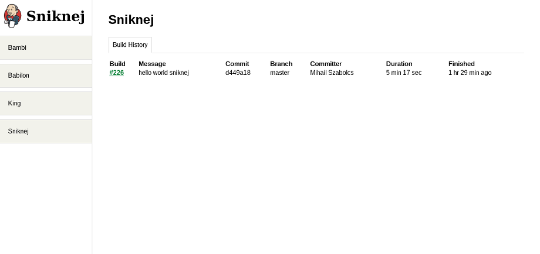
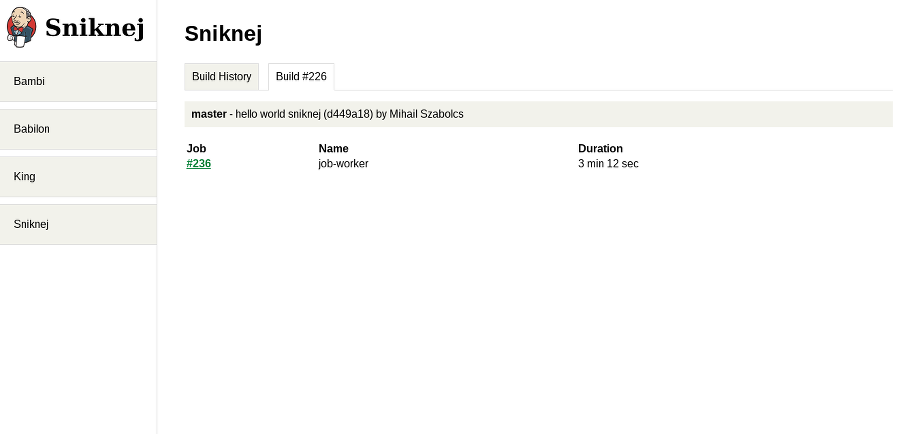
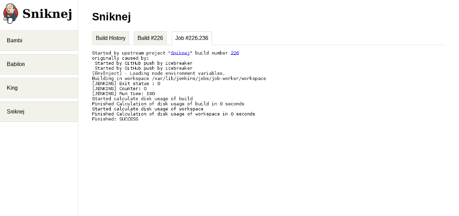

Sniknej
=======
Sniknej is a *standalone front-end* for [Jenkins](http://jenkins-ci.org/).


You should consider it *pre alpha quality*; take everything with a grain of salt and 
pepper.

> No butlers were harmed during the making of Sniknej.

Look! No hands ma'! (a.k.a screenshots)
---------------------------------------






Raison d'être (a.k.a why?)
--------------------------
The user interface of Jenkins it is absolutely horrible to the point of causing
nausea and headaches after using it for extended periods of times. It is known
to cause madness as well, but luckily, I did not experience that first hand.

In all seriousness, Sniknej has been built from the ground-up using the Jenkins
REST API in order to act as an easy to use *front-end* without depending on the
`internal architecture` of Jenkins, thus *free* from breakage.

The purpose of Sniknej is by no means to replace the *administrative* part of
Jenkins, but rather to wrap its *user-facing* side, which is what you are going to
use 96% of the time.

Getting Started
---------------
Sninkej is written in Ruby and therefore it needs an environment that has a
`Ruby` interpreter (at least 1.9.3 and up).

Before it can be deployed a few `ENVIRONMENT` variables need to be defined.

```bash
export SNIKNEJ_JENKINS_URI='http://ci.site.com'
export SNIKNEJ_JENKINS_USER_ID='user_id'
export SNIKNEJ_JENKINS_API_TOKEN='api_token'
```

The URI should be self-explanatory and it should point to the `root` of your
Jenkins instance.

The USER_ID and API_TOKEN can be obtained by logging into Jenkins then going to your
profile, clicking `Configure` then `Show API Token ...`.

```bash
export SNIKNEJ_AUTH_USER='jenkins'
export SNIKNEJ_AUTH_PASS='sniknej'
```

Sniknej uses a `Basic Authentication` challenge as the sole authentication
mechanism and these environment variables define the given USER and PASS for
it.

If you do not define them, `Basic Authentication` will be disabled, which isn't
recommended unless you have some IP based filtering in place so that the
outside world cannot get access to your Sniknej instance.

After the environment variables have been defined it can be launched just like 
any standard `rack` application via the good old `rackup`.

Contribute
----------
* Fork the project.
* Make your feature addition or bug fix.
* Do **not** bump the version number.
* Send me a pull request. Bonus points for topic branches.

License
-------
Copyright (c) 2014, Mihail Szabolcs

Sniknej is provided **as-is** under the **MIT** license. For more information see
LICENSE.

The Sniknej logo is a modified version of the original [Jenkins](http://jenkins-ci.org/) logo. 
You can find out more information about it (including its LICENSE) by visiting the following
[link](https://wiki.jenkins-ci.org/display/JENKINS/Logo).
